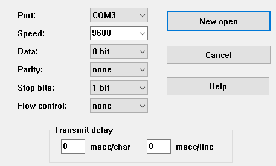
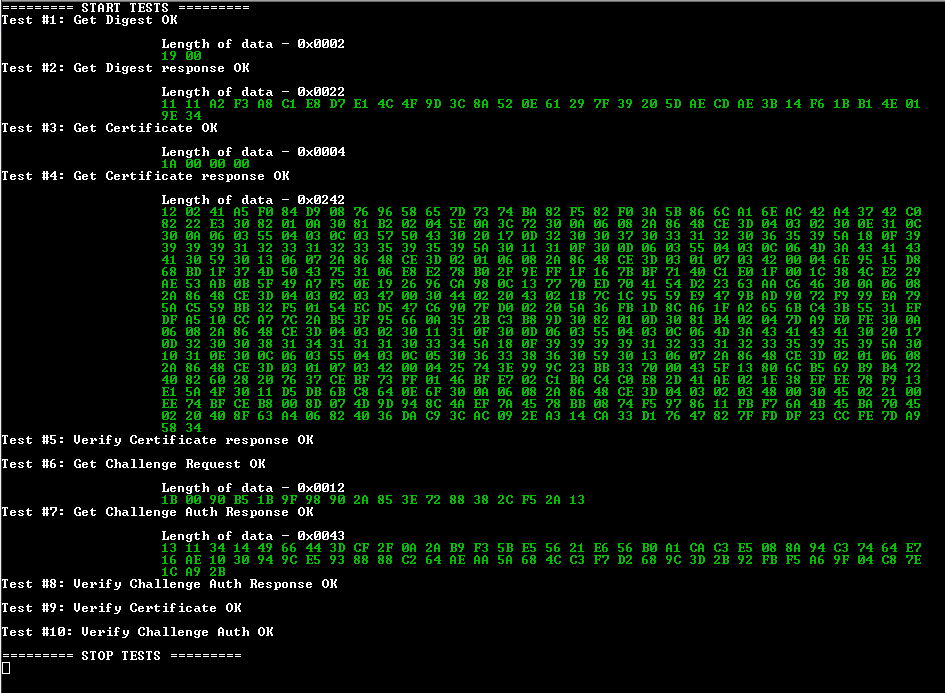

# WPC Qi 1.3 Authentication protocol with  OPTIGA&trade; Trust Charge

## Description

This application note demonstrates partial implementation of the WPC Qi 1.3 Authentication Flow with help of the OPTIGA&trade; Trust Charge device authentication solution.
In particular this application note shows several things:
* API to form correct messages according to the WPC Qi 1.3. Authentication. It's important to highlight, that this code doesn't implement the authentication flow itself, rather just prepares messages which might be forwarded to the respective endpoint.
* Example usage of the API with a test flow
* Test Vectors against the API

Please check out also our description of the [WPC Qi 1.3 Authentication API](docs/WPC-Qi-Authentication-API.md) that shows you the essential message exchange and respective function calls.

## Hardware setup

For this application note, you need an official [OPTIGA&trade; Trust Charge Evaluation Kit](https://www.infineon.com/cms/en/product/evaluation-boards/optiga-trust-ch-eval-kit/)

## Software setup

### Install DAVE&trade; IDE

NOTE: The DAVE&trade; IDE supports Windows platforms up to Windows 10.

Please follow these steps to install the DAVE&trade; IDE:

1. Go to Infineon Developer Center and download [DAVE&trade; IDE](https://softwaretools.infineon.com/tools/com.ifx.tb.tool.daveide).
2. Choose the DAVE&trade; package for your operating system and submit your registration information. After you register, you should receive a confirmation email with a link to download a .zip file.
3. To install the DAVE&trade; IDE run the executable `daveide_<version>.exe`.

After installing the DAVE&trade; IDE, please continue with the next section to install SEGGER J-Link.

### Install SEGGER J-Link

To communicate with the XMC4700 Relax Kit's on-board debugging probe, you need the drivers included in the J-Link Software and Documentation pack. You can download the J-Link software and documentation from the [SEGGER J-Link software download page](https://www.segger.com/downloads/jlink/#J-LinkSoftwareAndDocumentationPack).

### Additional Software References

For more information on the DAVE&trade; IDE visit [DAVE&trade; Forum](https://www.infineonforums.com/threads/6212-Install-DAVE%C2%99-IDE-for-XMC%C2%99-microcontrollers).

##  Setting up your hardware

To set up the OPTIGA&trade; Trust Charge Evaluation Kit, please follow these steps:

1. To program the board connect your computer to the Debugger Micro USB port X101.
2. For logging purpose connect an additional USB cable to the Micro USB port X100 at the opposite side of the board.

NOTE: You can keep both Micro USB interfaces connected at the same time for an improved flashing and testing experience.
NOTE: Ensure that the Shield2Go Security OPTIGA&trade; Trust Charge in Socket 1 of the Infineon MyIoT Adapter

## Downloading the Code

To get the code you need either download one of existing [releases](https://github.com/Infineon/wpcqi-optiga-trust-charge/releases) or Git clone this repository as below.

`git clone --recurse-submodules https://github.com/infineon/wpcqi-optiga-trust-charge`

## Importing the WPC Qi 1.3 Auth application note project into DAVE&trade;

1. Start the DAVE&trade; IDE.
2. Choose File, and then choose Import. Expand the Infineon folder, choose DAVE&trade; Project, and then choose Next.
3. In the Import DAVE&trade; Projects window, choose Select Root Directory, choose Browse, and then choose the XMC4700 demo project.
4. In the directory where you have your cloned/downloaded sources the XMC4700 demo project is located in `projects/xmc4700_relax_kit_qi_auth_example/`
5. Make sure that Copy Projects Into Workspace is cleared.
6. Choose Finish.

The `xmc4700_qi_auth_example` project should be imported into your workspace and activated.

## Build configurations

This example project showcases the implementation of both sides, the Power Receiver (PRx) and the Power Transmitter (PTx), at the same time. You can choose between different variants of crypto backends and between the use of the extensive OPTIGA&trade; Trust Charge Software Framework or a minimalistic variant with a pure implementation of the Infineon I2C communication protocol.

To select the build configuration, please follow these steps:
 * Right Click on the Project and select "Build Configurations" 
 * -> "Set Active" 
 * -> Make a choice between the following configurations.

| Configuration            | PRx Crypto Backend         | PTx Crypto Backend                    | Description                                           |
| :------------------------|:-------------------------- | :------------------------------------ | :---------------------------------------------------- |
| `optiga_prx_crypto`      | OPTIGA&trade; Trust Charge | OPTIGA&trade; Trust Charge            | Standard setup using OPTIGA&trade; Trust Charge for both PRx and PTx using the [OPTIGA&trade; Trust Charge Software Framework](https://github.com/Infineon/optiga-trust-charge) |
| `software_prx_crypto`    | mbedTLS software library   | OPTIGA&trade; Trust Charge            | PRx role: Using a purely software based approach using mbedTLS for the PRx side               |
| `optiga_ptx_without_cmd` | N/A                        | OPTIGA&trade; Trust Charge (minimal)  | PTx only minimalistic setup with minimum RAM and FLASH memory consumed and based on a pure Infineon I2C protocol communication protocol implementation. In general the difference to the standard PTx implementation is [this file](https://github.com/Infineon/wpcqi-optiga-trust-charge/blob/master/wpc/PTx/qi_auth_ptx_crypt_wocmd.c). |

NOTE: The performance of the purely software based variant `software_prx_crypto` is significantly lower than the `optiga_prx_crypto` configuration based on the OPTIGA&trade; Trust Charge security controller.

NOTE: The `optiga_ptx_without_cmd` build configuration does not output any log messages to the serial port as the goal is to provide a minimalistic scenario.

NOTE: In case the certificate and the corresponding private key are located in slots other than `0xE0E0`/`0xE0F0`, you can change this [here](https://github.com/Infineon/wpcqi-optiga-trust-charge/blob/15d8e7142f150832284054f6bb99414bcf832643/wpc/PTx/qi_auth_ptx_crypt.c#L46-L48)

## Establishing a serial connection for debugging

For the build configurations `optiga_prx_crypto` and `software_prx_crypto`, this project offers debug output on the serial interface via the Micro USB port X100.

We highly recommend, to use [Tera Term](https://ttssh2.osdn.jp/index.html.en) for displaying the logging output. Under  

## Output

The following screenshot shows example output for the `optiga_prx_crypto` and `software_prx_crypto` build configurations.

## Contributing

Please read [CONTRIBUTING.md](CONTRIBUTING.md) for details on our code of conduct, and the process for submitting pull requests to us.

## License
This project is licensed under the MIT License - see the [LICENSE](LICENSE) file for details
