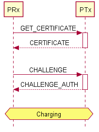
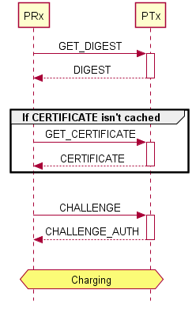
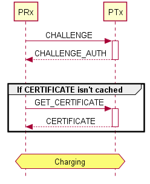

# WPC Qi authentication

The WPC Qi Authentication API comprises two components
* Qi Auth Crypt to perform crypto related operations
* Qi Auth to prepare authentication packets according to WPC Qi Auth 1.3 specification

Almost all of the below mentioned functions are used in [this](../master/wpc/qi_auth_self_test.c#L39) test routine

As per WPC Qi Authentication Protocol there are two counterparts in the authentication flow: Power Transmitter (PTx) and Power Receiver (PRx). The latter initiates the communication with the PTx to charge itself.

## WPC Qi authentication flows

There are three basic flows proposed by the WPC Qi Authentication protocol.

### Authentication - Simple flow



### Authentication - Simple flow with caching



### Authentication - Challenge first flow



## Summary of API functions

The following API is split into two groups: PRx and PTx, they are independent and can be used separately. A case when they can be used together might be a device with a reverse charging feature. 

### Power Receiver (PRx) API

#### High-level messages

The PRx entity should be able to send the following messages:
* `GET_DIGESTS`
* `GET_CERTIFICATE`
* `CHALLENGE` 
  * includes cryptographically secure random data
  * verify the incoming certificate (includes SH256 and ECDSA verify functions)

#### API overview

This API is implemented with either the OPTIGA&trade; Trust Charge security controller or a 3rd-party software crypto library (custom mbedTLS version) as crypto backend. You can switch between the two variants by including either [`qi_auth_prx_crypt.c`](../master/wpc/PRx/qi_auth_prx_crypt.c) or [`qi_auth_prx_crypt_soft.c`](../master/wpc/PRx/qi_auth_prx_crypt_soft.c) files.

  * User API: `qi_auth_prx.h`
    * [qi_auth_prx_init](#qi_auth_prx_init)
    * [qi_auth_prx_deinit](#qi_auth_prx_deinit)
    * [qi_auth_prx_get_digests](#qi_auth_prx_get_digests)
    * [qi_auth_prx_get_certificate](#qi_auth_prx_get_certificate)
    * [qi_auth_prx_challenge](#qi_auth_prx_challenge)
    * [qi_auth_prx_verify_chall_auth](#qi_auth_prx_verify_chall_auth)
    * [qi_auth_prx_verify_cert](#qi_auth_prx_verify_cert)
    * [qi_auth_prx_get_certchain_info](#qi_auth_prx_get_certchain_info)


### Power Transmitter (PTx) API

#### High-level messages

The PTx entity should be able to send the following messages:
* `DIGESTS`
  * includes SHA256 operation
* `CERTIFICATE`
* `CHALLENGE_AUTH` 
  * includes SHA256 and ECDSA sign functions

#### API overview

This API is implemented with the OPTIGA&trade; Trust Charge security controller as crypto backend using either  the extensive  OPTIGA™ Trust Charge Software Framework or a minimalistic variant with a pure implementation of the Infineon I2C communication protocol. You can switch between the two variants by including either [`qi_auth_ptx_crypt.c`](../master/wpc/PTx/qi_auth_ptx_crypt.c) or [`qi_auth_ptx_crypt_wocmd.c`](../master/wpc/PRx/qi_auth_ptx_crypt_wocmd.c) files.

  * User API: `qi_auth_ptx.h`
    * [qi_auth_ptx_init](#qi_auth_ptx_init)
    * [qi_auth_ptx_deinit](#qi_auth_ptx_deinit)
    * [qi_auth_ptx_error](#qi_auth_ptx_error)
    * [qi_auth_ptx_digests](#qi_auth_ptx_digests)
    * [qi_auth_ptx_certificate](#qi_auth_ptx_certificate)
    * [qi_auth_ptx_challenge_auth](#qi_auth_ptx_challenge_auth)

### Detailed API description

#### qi_auth_ptx_init

* **Prototype**
	```c
    int32_t  qi_auth_ptx_init(void);
	```
* **Description:**  Initializes the library
* **Returns:** 
	* `0` On success
	* Error code

[Top](#top)


#### qi_auth_ptx_deinit

* **Prototype**
	```c
    int32_t  qi_auth_ptx_deinit(void);
	```
* **Description:**  Initializes the library
* **Returns:** 
	* `0` On success
	* Error code

[Top](#top)


#### qi_auth_ptx_error

* **Prototype**
	```c
    uint16_t qi_auth_ptx_error(uint8_t error_code, uint8_t error_data, uint8_t* p_resp, uint16_t* resp_size);
	```
* **Description:**  Returns an ERROR message in a form defined by WPC Qi Auth Rel 1.3
* **Arguments:**
	* `error_code`: Error code to be transmitted
	* `error_data`: Error data to be transmitted
	* `p_resp`: Output buffer
	* `resp_size`: Length of the buffer
* **Returns:** 
	* `0` On success
	* Error code

[Top](#top)

#### qi_auth_ptx_digests

* **Prototype**
	```c
    uint16_t qi_auth_ptx_digests(uint8_t slot, uint8_t* p_resp, uint16_t* resp_size);
	```
* **Description:**  Returns a DIGEST message in a form defined by  WPC Qi Auth Rel 1.3
* **Arguments:**
	* `slot`: Slot number
	* `p_resp`: Output buffer where the digest message will be stored
	* `resp_size`: Length of the buffer
* **Returns:** 
	* `0` On success
	* Error code

[Top](#top)

#### qi_auth_ptx_certificate

* **Prototype**
	```c
    uint16_t qi_auth_ptx_certificate(uint8_t slot, uint8_t offset, uint8_t* p_resp, uint16_t* resp_size);
	```
* **Description:**  Returns a Certificate Chain in a form defined by WPC Qi Auth Rel 1.3
* **Arguments:**
	* `slot`: Slot number
	* `offset`: Offset
	* `p_resp`: Output buffer where the certificate message will be stored
	* `resp_size`: Length of the buffer
* **Returns:** 
	* `0` On success
	* Error code

[Top](#top)

#### qi_auth_ptx_challenge_auth

* **Prototype**
	```c
    uint16_t qi_auth_ptx_challenge_auth(uint8_t slot, uint8_t* p_challreq, uint8_t challreq_size,
		                                 uint8_t* p_resp, uint8_t* resp_size);
	```
* **Description:**  Returns a Challenge message in a form defined by WPC Qi Auth Rel 1.3
* **Arguments:**
	* `slot`: Slot number
	* `p_challreq`: Input Challenge request 
	* `challreq_size`: Length of the challenge
	* `p_resp`: Output buffer where the challenge auth message will be stored
	* `resp_size`: Length of the buffer
* **Returns:** 
	* `0` On success
	* Error code

[Top](#top)

#### qi_auth_prx_get_digests

* **Prototype**
	```c
    uint16_t qi_auth_prx_get_digests(uint8_t slot, uint8_t* p_req, uint16_t* req_size);
	```
* **Description:**  Returns a GET DIGESTS message in a form defined by WPC Qi Auth Rel 1.3
* **Arguments:**
	* `slot`: Slot number
	* `p_req`: Output buffer
	* `req_size`: Length of the buffer
* **Returns:** 
	* `0` On success
	* Error code

[Top](#top)


#### qi_auth_prx_get_certificate

* **Prototype**
	```c
	uint16_t qi_auth_prx_get_certificate(uint32_t offset, uint32_t length, uint8_t slot,
		                                    uint8_t* p_req, uint16_t* req_size);
	```
* **Description:**  Returns a GET_CERTIFICATE message in a form defined by WPC Qi Auth Rel 1.3
* **Arguments:**
	* `offset`: Offset.	These two fields combine to form the offset in bytes from
                the start of the Certificate Chain to where the read request begins offset value

	* `length`: Length in bytes to read. The length value is length98*256+length70. It is an error to specify a length that
                would result in reading beyond end of the Certificate Chain
	* `slot`: Slot number
	* `p_req`: Output buffer
	* `req_size`: Pointer to he length of the buffer
* **Returns:** 
	* `0` On success
	* Error code

[Top](#top)


#### qi_auth_prx_challenge

* **Prototype**
	```c
    uint16_t qi_auth_prx_challenge(uint8_t slot, uint8_t* p_req, uint16_t* req_size);
	```
* **Description:**  Returns a Challenge message in a form defined by WPC Qi Auth Rel 1.3
* **Arguments:**
	* `slot`: Slot number
	* `p_req`: Output buffer
	* `req_size`: Length of the buffer
* **Returns:** 
	* `0` On success
	* Error code

[Top](#top)


#### qi_auth_prx_verify_chall_auth

* **Prototype**
	```c
    uint16_t qi_auth_prx_verify_chall_auth(uint8_t* p_sha256,
                                           uint8_t* p_puc_pubkey, uint16_t pubkey_size,
		                           uint8_t* p_challreq, uint16_t challreq_size,
		                           uint8_t* p_challresp, uint16_t challresp_size);
	```
* **Description:**  Verifies a given Response message in a form defined by WPC Qi Auth Rel 1.3. Challenge auth message is given as an input
* **Arguments:**
	* `p_sha256`: Hash of the certificate Chain 
	* `p_puc_pubkey`: Public key of the Product Unit Certificate
	* `pubkey_size`: Size of the public key
	* `p_challreq`: Input Challenge request 
	* `challreq_size`: Length of the challenge
	* `p_challresp`: Input Challenge response 
	* `challresp_size`: Length of the challenge response 
* **Returns:** 
	* `0` On success
	* Error code

[Top](#top)

#### qi_auth_prx_verify_cert

* **Prototype**
	```c
    uint16_t qi_auth_prx_verify_cert(uint8_t* p_certchain, uint16_t chain_size, const uint8_t* p_root_ca, uint16_t root_ca_size);
	```
* **Description:**  Verifies a given Response message in a form defined by WPC Qi Auth Rel 1.3. Certificate Chain is given as an input
* **Arguments:**
	* `p_certchain`: Pointer to the certificate Chain (it should start as defined in the standard, with two first bytes of length, Root CA Hash, etc)
	* `chain_size`: Chain Size
	* `p_root_ca`: Pinter ot the Root CA Certificate used to verify this chain. In field usage this shouldn't be changed, but during testing and plugfests this field might vary. DER encoded hex array is expected.
	* `root_ca_size`: Size of the chain 
* **Returns:** 
	* `0` On success
	* Error code

[Top](#top)
